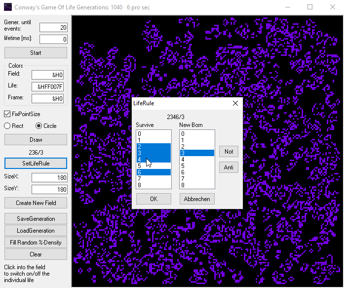

# Game_OfLifeConway  
## Conways Game Of Life  
  
 

In august 2008 I immediately had to start this project when I stumbled across cellular automata for the first time.
You can play around with different death-life-rules. The original rule of Conway was 23/3
If you try rules 234/3 or 2346/3 you get structures that very much look like amazing mazes.
If you save it to a file you can import it in GamePathfinder. 
Maybe also have a look at the pathfinder project [here](https://github.com/OlimilO1402/Game_PathFinder).

